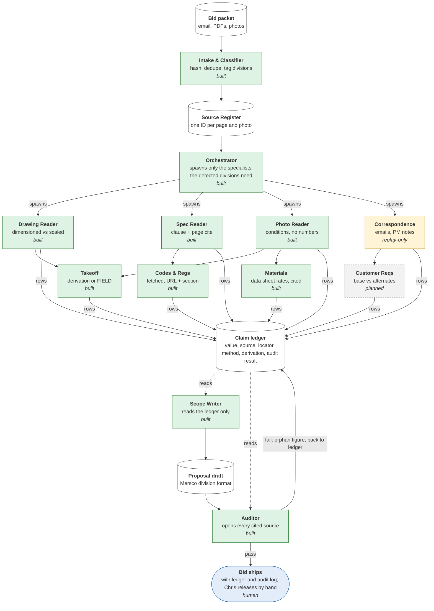

# Pipeline DAG

Generated from [`pipeline/dag.py`](../pipeline/dag.py) by `python3 tools/render_dag.py`. Do not edit by hand:
CI runs `tools/render_dag.py --check` and `tests/test_dag.py`, so a change to the pipeline that does not
update the DAG fails the build.

Source: "Pipeline at a glance", architecture doc p.2. Status says how far the code has got with each node.

| Node | Status | Phase | Principal | Code |
|---|---|---|---|---|
| Bid packet | data | — | — | — |
| Intake & Classifier | built | 1 | intake | [`pipeline/intake.py`](../pipeline/intake.py) |
| Source Register | data | — | — | [`pipeline/ledger.py`](../pipeline/ledger.py) |
| Orchestrator | built | 3 | orchestrator | [`pipeline/orchestrator.py`](../pipeline/orchestrator.py) |
| Drawing Reader | built | 2 | drawing_reader | [`pipeline/readers/prompts/drawing.md`](../pipeline/readers/prompts/drawing.md) |
| Spec Reader | built | 2 | spec_reader | [`pipeline/readers/prompts/spec.md`](../pipeline/readers/prompts/spec.md) |
| Photo Reader | built | 2 | photo_reader | [`pipeline/readers/prompts/photo.md`](../pipeline/readers/prompts/photo.md) |
| Correspondence | replay-only | 2 | correspondence_reader | [`pipeline/readers/prompts/correspondence.md`](../pipeline/readers/prompts/correspondence.md) |
| Takeoff | built | 3 | takeoff | [`pipeline/takeoff.py`](../pipeline/takeoff.py) |
| Codes & Regs | built | 4 | codes | [`pipeline/webread.py`](../pipeline/webread.py) |
| Materials | built | 4 | materials | [`pipeline/webread.py`](../pipeline/webread.py) |
| Customer Reqs | planned | 3 | customer_requirements | — |
| Claim ledger | data | — | — | [`pipeline/broker.py`](../pipeline/broker.py) |
| Scope Writer | built | 3 | scope_writer | [`pipeline/scope_writer.py`](../pipeline/scope_writer.py) |
| Proposal draft | data | — | — | — |
| Auditor | built | 1 | auditor | [`pipeline/auditor.py`](../pipeline/auditor.py) |
| Bid ships | human | — | chris | — |

Status key: **built** is in the repo and tested; **replay-only** is built and tested on recorded model output
with no live model call yet; **planned** is in the architecture doc but not built; **human** is a person's
step the pipeline cannot take; **data** is a store or a document.
